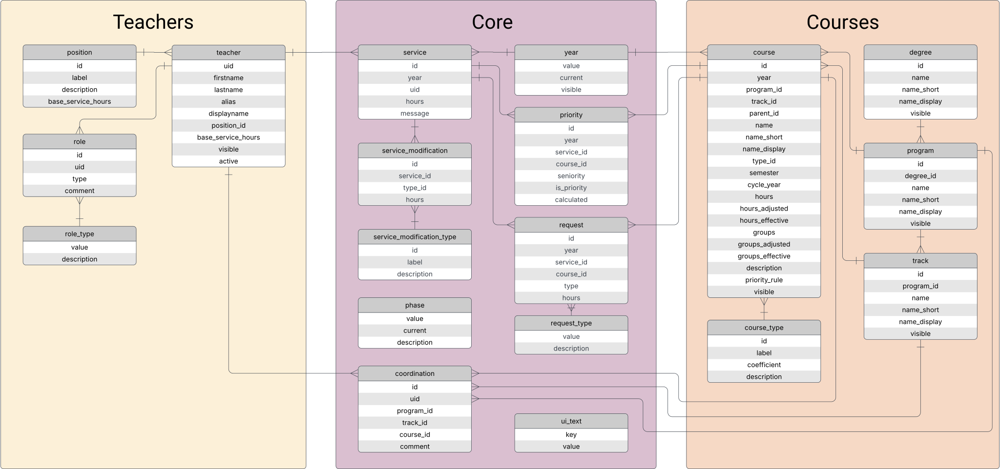

# Geyser


Geyser is a web application that streamlines the course assignment process in educational institutions. It manages the
complete workflow from initial teacher requests through commission decisions to final assignments. Built with
PostgreSQL, Hasura GraphQL, NestJS, and Keycloak authentication, it provides a secure and efficient "Course Assignment Flow".

## Quick Start

This guide will get you a working instance instance of Geyser in minutes.

### System Requirements and Dependencies

#### Core Requirements

- Linux or macOS
- Docker Engine 25.0 or later (with Docker Compose V2)
- Hasura CLI

#### Install Dependencies

Install Docker with Docker Compose:

```shell
curl -fsSL https://get.docker.com | sh
sudo usermod -aG docker $USER  # Log out and back in after this
```

Install Hasura CLI:

```shell
curl -L https://github.com/hasura/graphql-engine/raw/stable/cli/get.sh | bash
```

Optional tools:

```shell
# Oh My Zsh (required for zsh completion)
sh -c "$(curl -fsSL https://raw.githubusercontent.com/ohmyzsh/ohmyzsh/master/tools/install.sh)"
```

### Installation

Download and install the latest version (in `~/.geyser/<version>/`):

```shell
curl -fsSL https://github.com/arkandias/geyser-monorepo/raw/HEAD/scripts/install.sh | sh
```

Or for a specific version:

```shell
GEYSER_VERSION="1.2.3"
curl -fsSL "https://github.com/arkandias/geyser-monorepo/raw/${GEYSER_VERSION}/scripts/install.sh" | sh
```

### Initialization

1. Edit the file `~/.geyser/<version>/.env` and replace `geyser.example.com` with your server's hostname.

2. Add the TLS certificates for your server's hostname to the `nginx/certs` directory:
   - `nginx/certs/fullchain.crt` should contain the full certificate chain
   - `nginx/certs/private.key` should contain the private key

3. Initialize Geyser with the following command:

   ```shell
   geyser init
   ```

   N.B. If you get a "command not found" error, add `~/.local/bin` to your PATH:

   ```shell
   export PATH="$HOME/.local/bin:$PATH"
   ```

   Add this line to your shell configuration file (e.g., `~/.bashrc` or `~/.zshrc`) to make it permanent.

   Alternatively, you can use the full path to the script: `~/.geyser/<version>/scripts/geyser`

4. During initialization, you will be prompted for Keycloak temporary admin account username and password (choose a
   strong one!).

5. Once the initialization is finished, the following services are accessible in a web browser:
   - Keycloak: `https://<server-hostname>/auth`
   - Geyser: `https://<server-hostname>`

### Creating a first user in Keycloak

The account you created during initialization is a temporary account for the so-called master realm. This realm is
intended to administrate the other realms only. Thus, Geyser uses a different realm to authenticate users, namely the
geyser realm. We will now create a first user in this realm, with privileges to administrate the app. In a web browser,
go to: `https://<server-hostname>/auth`

1. Connect to Keycloak admin console using the temporary admin account.

   

2. Once logged in, click on the "Manage realms" button in the left menu and select "geyser" (click on the name).

   

3. Now, "Geyser" must be displayed on the left of the "Current realm" badge. Click on the "Users" button in the left
   menu, and then on the "Create new user" button.

   

4. Fill in the user information. You must provide an email (the first name and last name are optional). "Email verified"
   must be "On" (at the top of the form). Then, click on the "Join Groups" button (at the bottom of the form).

   

5. In the dialog "Select the groups to join", check the box of the "AppAdmin" group and click on the "Join" button. This
   will give your user the admin privileges in Geyser.

   

6. Now that the user is created, you will be redirected to the user details tab. Click on the tab "Credentials", and
   then on the "Set password" button.

   

7. Enter you new user's password (twice), set "Temporary" to "Off", and click on the "Save" button.

   

8. Go to: `https://<server-hostname>` and log into Geyser with the user email and password.

   

9. You can now refer to [the app documentation]() to configure Geyser.

#### Advanced Keycloak configuration

For an advanced configuration of Keycloak, you can refer to [Keycloak's documentation](https://www.keycloak.org/documentation).

We simply point some useful login options which might be useful.

1. If you want to allow users to create an account in Keycloak and to recover their password, you can enable this option
   on the "Login" tab of the "Realm settings" page (see the button in the left menu).

   

   For these options to work, you need to configure an email address first in the "Email" tab.

   

   

2. You may use an external identity provider, for example if your institution or your company provides one. This can be
   configured on the "Identity providers" page (see the button in the left menu).

   

**_N.B. Users with a Keycloak account will not automatically have access to Geyser. Keycloak is only used to
authenticate users with their email address. Access is configured from within the app._**

## Architecture Overview

Geyser consists of multiple services, each running in a Docker container organized into three logical tiers:

### Frontend (frontend)

The frontend is an Nginx server that serves as the main entry point and reverse proxy for all external access:

- `https://<server-hostname>` serves the web client application
- `https://<server-hostname>/api` proxies requests to the backend NestJS server
- `https://<server-hostname>/auth` proxies requests to the Keycloak authentication service

The frontend also handles TLS termination and serves static assets for the web application.

### Backend (backend, hasura, db)

The backend tier consists of three interconnected services:

- **NestJS Server (backend)**: The main API server accessible via the frontend proxy at `/api`
- **Hasura GraphQL Engine (hasura)**: Provides GraphQL interface to the database
- **PostgreSQL Database (db)**: Stores all application data

The NestJS server can query the database either directly via SQL or through Hasura's GraphQL API. Both the database and
Hasura are isolated on a private network (`private-db`) and are only accessible by the NestJS server -- they cannot be
reached from outside the Docker environment.

### Authentication (keycloak, kc-db)

User authentication is handled by a dedicated Keycloak instance with its own PostgreSQL database:

- **Keycloak (keycloak)**: OpenID Connect provider for user authentication, accessible via the frontend at `/auth`
- **Keycloak Database (kc-db)**: Dedicated PostgreSQL instance storing user credentials and identity data

The authentication flow works as follows:

1. Users authenticate with Keycloak using their email address
2. The backend validates tokens with Keycloak and fetches additional user information (roles, permissions)
3. The backend issues its own access tokens for API requests
4. Clients include these access tokens in API requests for authorization

### Network Architecture

Services are organized into three Docker networks:

- `public`: Connects frontend, backend, and keycloak for external-facing communication
- `private-db`: Isolates the main database and Hasura from external access
- `private-kc-db`: Isolates the Keycloak database for security

## Configuration

### Environment Variables

#### Configuration Files

Geyser uses two environment files:

- `.env`: Base configuration file with default values
- `.env.local`: Local overrides (not version-controlled)

Variables in `.env.local` take precedence over those in `.env`.

#### Available Variables

| Environment variable          | Default value | Explanation                                                                               |
| ----------------------------- | ------------- | ----------------------------------------------------------------------------------------- |
| `GEYSER_ENV`                  | `production`  | Deployment environment (`development`/`production`)                                       |
| `GEYSER_DOMAIN`               | `localhost`   | Hostname (and optionally port number) where Geyser is served (e.g., `geyser.example.com`) |
| `GEYSER_TENANCY`              | `single`      | Tenancy mode (`single`/`multi`)                                                           |
| `GEYSER_LOG_LEVEL`            | `info`        | Logging threshold (`silent`/`debug`/`info`/`warn`/`error`)                                |
| `GEYSER_AS_SERVICE`           | `false`       | Indicate if Geyser is running as a systemd service (`true`/`false`)                       |
| `KC_DB_PASSWORD`              | **Required**  | Password for Keycloak database privileged role                                            |
| `DB_PASSWORD`                 | **Required**  | Password for the main database privileged role                                            |
| `HASURA_GRAPHQL_ADMIN_SECRET` | **Required**  | Hasura admin secret (bypass token authentication)                                         |
| `API_ADMIN_SECRET`            | **Required**  | API admin secret (bypass token authentication)                                            |
| `OIDC_CLIENT_SECRET`          | **Required**  | Secret for Keycloak `app` client used by backend to authenticate users                    |

## Main database schema



## Administration

### Administration Script

The `geyser` script provides a comprehensive set of commands to manage your installation:

#### Core Commands

- `init`: Initialize a fresh Geyser installation
- `start`: Start Geyser services
- `stop`: Stop Geyser services
- `update`: Update Geyser services
- `reset`: Reset Geyser to a fresh installation

#### Data Management

- `backup`: Create a backup of Geyser main database
- `restore`: Restore Geyser main database from a backup
- `export-realms`: Export Keycloak realms and users
- `import-realms`: Import Keycloak realms and users
- `sync-keycloak`: Synchronize Keycloak users and groups with app data

#### Development Tools

- `compose`: Docker Compose wrapper
- `hasura`: Hasura CLI wrapper
- `kc`: Keycloak CLI access
- `kcadm`: Keycloak Admin CLI access
- `rsync`: Configured rsync wrapper

#### Options

- `-h, --help`: Show help message
- `-v, --version`: Show version information
- `-s, --status`: Show current status
- `-q, --quiet`: Disable log messages

Run `geyser COMMAND --help` for more information on a command.

### Shell Completion

For zsh users, shell completion can be installed with:

```shell
geyser install-completion
```

### Automatic Backups

The script `scripts/backup.sh` is provided to automatically create a backup of Geyser and upload it to a WebDAV server
(e.g., Nextcloud). It can be scheduled via crontab for regular backups.

Configuration:

- Required environment variables:
  - `WEBDAV_URL`: Base URL of the WebDAV server
  - `WEBDAV_USER`: WebDAV username
  - `WEBDAV_PASS`: WebDAV password
  - `WEBDAV_DIR`: Directory for uploads on the WebDAV server
- Can be set in `.env`, `.env.local`, or environment

Example crontab entries:

```
# Hourly backups in June and July
0 * * 6,7 * /path/to/scripts/backup.sh

# Daily at 3:00 AM other months
0 3 * 1-5,8-12 * /path/to/scripts/backup.sh
```

## Contributing

Bug reports, feature requests, and pull requests are welcome on GitHub.

## License

This project is licensed under the GNU Affero General Public License v3.0 &ndash; see the [LICENSE](LICENSE) file for
details.
