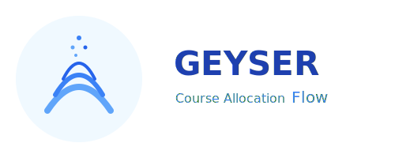

<div style="background-color: #ffffff">
    
</div>

## Getting Started

These instructions will get you a copy of the project up and running on your local machine for development and testing
purposes.

### Installation

Start by cloning the project's repository (you need Git for this):

```shell
git clone https://github.com/arkandias/geyser-backend.git
```

This will create a directory `geyser-backend` in your working directory. Switch to this directory:

```shell
cd geyser-backend
```

The essential tools that need to be installed on your machine include:

- Docker Compose
- Hasura CLI

Although not necessary, the following tools are needed to use some of the convenient scripts provided with this project:

- PostgreSQL
- jq

On Ubuntu, these tools can be installed all at once:

```shell
./scripts/install_tools
```

If you're using Bash or Zsh, you can add the environment variables `GEYSER_DIR` and `GEYSER_MODE` to your profile, as
well as some convenient aliases:

```shell
source ./scripts/add_configuration
``` 

### Configuration

#### Environment variables

Environment variables can be stored in either of the following .env files:

- `.env.local`
- `.env.development` and `.env.development.local` (development mode)
- `.env.production` and `.env.production.local` (production mode)

The passwords/secrets that must be set (typically in `.env.local`):

| Environment variable          | Explanation                                                           |
|-------------------------------|-----------------------------------------------------------------------|
| `POSTGRES_PASSWORD`           | Password for the role `postgres` in the Geyser database (superuser)   |
| `POSTGRES_KC_PASSWORD`        | Password for the role `postgres` in the Keycloak database (superuser) |
| `KEYCLOAK_ADMIN_PASSWORD`     | Password for the initial admin user `admin` of the keycloak container |
| `HASURA_GRAPHQL_ADMIN_SECRET` | Admin secret for Hasura GraphQL Engine                                |

The following environment variable must also be set (either in `.env.local` or one of `.env.dev` and `.env.prod`):

| Environment variable | Explanation                                                                                                              |
|----------------------|--------------------------------------------------------------------------------------------------------------------------|
| `SERVER_HOST`        | The hostname and, optionally, the port number at which the web app will be served (e.g. `localhost:5173`, `example.com`) |

[//]: # (TODO: update)
*N.B. In order to run the application, all three files `.env.development`, `.env.production`, and `.env.local` must
exist at the root of the project.*

#### SSL Certificates

The SSL certificates must be placed in `certs/`, see [here](certs/README.md).

### Running Geyser

The script `scripts/geyser` provides the following commands:

- `start` to start Geyser
- `stop` to stop Geyser
- `restart` to restart Geyser
- `update` to update Geyser
- `reset` to starts a fresh configuration
- `backup` to make a backup of the databases
- `restore` to restore a backup of the databases

Use these command with one of the following options:

- `--dev` in a development environment
- `--prod` in a production/staging environment

Equivalently, you can set the environment variable `GEYSER_MODE` to `development` or `production`.

## Components

Here we list the various components of Geyser. Each component corresponds to a single Docker container.

### Geyser database

A PostgreSQL container is running as service `db`.
It contains a database named `geyser`, which contains the data relative to Geyser in the `public` schema, and Hasura
metadata in the `hdb_catalog` schema.
This database is accessible on the host port `5432`.

### Hasura (GraphQL Engine)

An Hasura container is running as service `hasura`.
It is connected to the Geyser database and is used by the web client to make GraphQL queries.
The GraphQL API is available at:

- http://localhost:8090/v1/graphql in development mode
- https://example.com/graphql in production mode (assuming `SERVER_HOST=example.com`)

Hasura permissions are handled by giving users some of the following roles.

In development mode, you can run `scripts/hasura console` to access the console at http://localhost:9695.

| Role          | Explanations                                         |
|---------------|------------------------------------------------------|
| `intervenant` | The base user role with restricted permissions       |
| `commissaire` | Some extra permissions during the "commission" phase |
| `admin`       | The superuser role with all permissions              |

### Keycloak

A Keycloak container is running as service `keycloak`.
It manages the authentication and the roles of the Hasura users using JWT tokens.

#### Endpoints

In development mode, Keycloak can be reached at http://localhost:8080.

In production mode, the following ports are exposed by the reverse proxy (assuming `SERVER_HOST=example.com`):

| Path          | Reverse proxy path                  |
|---------------|-------------------------------------|
| `/js/`        | https://example.com/auth/js/        |
| `/realms/`    | https://example.com/auth/realms/    |
| `/resources/` | https://example.com/auth/resources/ |

In particular, the path `/admin/` is not exposed for security reason.
You can access this path using SSH Tunnel: if you connect with `ssh -L  8080:localhost:80` to the production server,
then `/auth/` can be reached at http://localhost:8080/auth/admin.
In particular, the admin console is available at http://localhost:8080/auth/admin.

### Keycloak database

A second PostgreSQL container is running as service `db_keycloak`.
It contains a database named `keycloak` dedicated to the Keycloak instance.
This database is accessible on the host port `5433`.

### Nginx (production only)

In production, a custom Nginx container is running as service `web`.
It is used as a reverse proxy, and serves the web client for the app.

## Contact

For any questions, comments, suggestions for improvements, or to report any errors or possible bugs, please contact
Julien Hauseux <[julien.hauseux@univ-lille.fr](mailto:julien.hauseux@univ-lille.fr)>.

## License

This project is licensed under the GNU Affero General Public License v3.0 &ndash; see the [LICENSE](LICENSE) file for
details.
