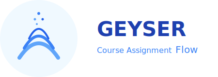
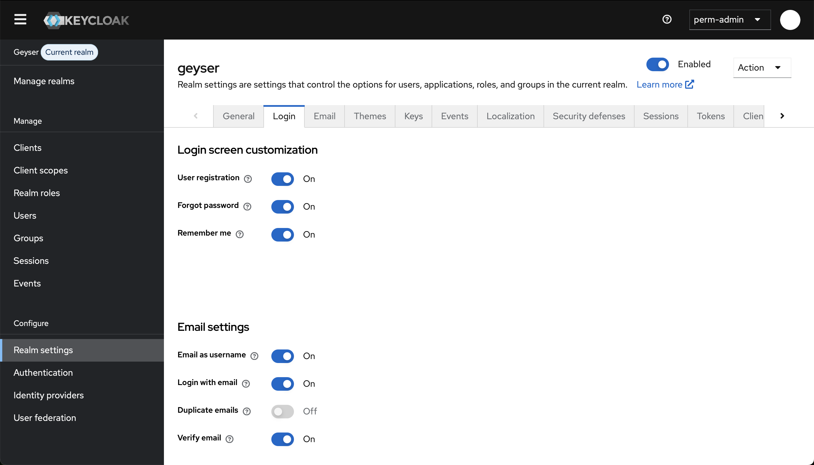

# Geyser



Geyser is a web application that streamlines the course assignment process in educational institutions.
It manages the complete workflow from initial teacher requests through commission decisions to final assignments.
Built with PostgreSQL, Hasura GraphQL, NestJS, and Keycloak authentication, it provides a secure and efficient
"Course Assignment Flow".

## Table of contents

- [Quick Start](#quick-start)
  - [System Requirements and Dependencies](#system-requirements-and-dependencies)
  - [Installation](#installation)
  - [Initialization](#initialization)
  - [Creating a first user in Keycloak](#creating-a-first-user-in-keycloak)
- [Architecture Overview](#architecture-overview)
  - [Frontend](#frontend)
  - [Backend](#backend)
  - [Authentication](#authentication)
  - [Network Architecture](#network-architecture)
- [Custom Packages](#custom-packages)
  - [Package `client`](#package-client)
  - [Package `server`](#package-server)
  - [Package `shared`](#package-shared)
- [Configuration](#configuration)
  - [Environment Variables](#environment-variables)
  - [Development Environment](#development-environment)
  - [Multi-tenant Mode](#multi-tenant-mode)
  - [Running Geyser as a systemd service](#running-geyser-as-a-systemd-service)
- [Administration](#administration)
  - [Administration Script](#administration-script)
  - [Automatic Backups](#automatic-backups)
  - [Updates and Deployment](#updates-and-deployment)
- [Contributing](#contributing)
- [License](#license)

## Quick Start

This guide will get you a working instance of Geyser in minutes.

### System Requirements and Dependencies

#### Core Requirements

- Linux or macOS
- Docker Engine 25.0 or later (with Docker Compose V2)
- Hasura CLI

#### Install Dependencies

Install Docker with Docker Compose:

```shell
curl -fsSL https://get.docker.com | sh
sudo usermod -aG docker $USER  # Log out and back in after this
```

Install Hasura CLI:

```shell
curl -L https://github.com/hasura/graphql-engine/raw/stable/cli/get.sh | bash
```

Optional tools:

```shell
# Oh My Zsh (required for zsh completion)
sh -c "$(curl -fsSL https://raw.githubusercontent.com/ohmyzsh/ohmyzsh/master/tools/install.sh)"
```

### Installation

#### Script-based installation

Download and install the latest version:

```shell
curl -fsSL https://github.com/arkandias/geyser/raw/HEAD/scripts/install.sh | sh
```

Or for a specific version (see the releases list [here](https://github.com/arkandias/geyser/releases)):

```shell
GEYSER_VERSION="1.2.3"
curl -fsSL "https://github.com/arkandias/geyser/raw/${GEYSER_VERSION}/scripts/install.sh" | sh
```

During the installation, you will be prompted for the installation directory (default is `~/.geyser/<version>`).

#### Git-based installation

Alternatively, you can clone the whole repository for development and easier
[Updates and Deployment](#updates-and-deployment) in production:

```shell
git clone https://github.com/arkandias/geyser.git
cd geyser
mkdir -p ~/.local/bin
ln -sf "$(pwd)/scripts/geyser" ~/.local/bin/geyser
```

In this case, the installation directory is wherever you cloned the repository (e.g., `~/geyser` if you cloned it to
your home directory).

#### Verify installation

Confirm the installation was successful:

```shell
geyser --version
```

If you get a "command not found" error, you may need to add `~/.local/bin` to your PATH:

```shell
export PATH="$HOME/.local/bin:$PATH"
```

Add this line to your shell configuration file (e.g., `~/.bashrc` or `~/.zshrc`) to make the modification persistent.

Alternatively, you can use the full path to the script:

```shell
<install-dir>/scripts/geyser --version
```

### Initialization

1. Edit the file `.env` and replace `geyser.example.com` with your server's hostname.

2. Add the TLS certificates for your server's hostname to the `certs/` directory:
   - `certs/fullchain.crt` should contain the full certificate chain
   - `certs/private.key` should contain the private key

3. Initialize Geyser with the following command:

   ```shell
   geyser init
   ```

4. During initialization, you will be prompted for Keycloak temporary admin account username and password (choose a
   strong one!).

5. Once the initialization is finished, the following services are accessible in a web browser:
   - Keycloak: `https://<server-hostname>/auth`
   - Geyser: `https://<server-hostname>`

### Creating a first user in Keycloak

The Keycloak account you created during initialization is a temporary account for the realm `master`.
This realm is intended to administrate the other realms only.
Thus, Geyser uses a different realm to authenticate users: the realm `geyser`.
We will now create a first user in this realm, with privileges to administrate the app.
In a web browser, go to: `https://<server-hostname>/auth`

1. Connect to Keycloak admin console using the temporary admin account.

   

2. Once logged in, click on the "Manage realms" button in the left menu and select "geyser" (click on the name).

   

3. Now, "Geyser" must be displayed next to the "Current realm" badge.
   Click on the "Users" button in the left menu, and then on the "Create new user" button.

   

4. Fill in the "Create user" form.
   You must provide an email and "Email verified" must be "On" (at the top of the form).
   The other fields are optional.
   Then, click on the "Join Groups" button (at the bottom of the form).

   

5. In the "Select the groups to join" dialog box, check the box of the "AppAdmin" group and click on the "Join" button.
   This will give the user admin privileges in Geyser.

   

6. Now that the user is created, you will be redirected to the user "Details" tab.
   Click on the "Credentials" tab, and then on the "Set password" button.

   

7. Enter your new user's password (twice), set "Temporary" to "Off", and click on the "Save" button.

   

8. Go to: `https://<server-hostname>` and log into Geyser with your newly created user email and password.

   

9. You can now refer to the app documentation to configure Geyser.

#### Advanced Keycloak configuration

For an advanced configuration of Keycloak, you can refer to
[Keycloak documentation](https://www.keycloak.org/documentation).

We simply point out some useful login options.

1. If you want to allow users to create an account in Keycloak and to recover their password, you can enable this option
   on the "Login" tab of the "Realm settings" page.

   

   For these options to work, Keycloak must be configured to send emails.
   You can do this in the "Email" tab.
   Note that the current admin user must have an email address to configure Keycloak's email.
   You can add one on the "Users" page.

   

   

2. You may use an external identity provider, for example if your institution or your company provides one.
   This can be configured on the "Identity providers" page.

   

**_Note: Users with a Keycloak account will not automatically have access to Geyser.
Keycloak is only used to authenticate users with their email address.
Access is configured within the app._**

## Architecture Overview

Geyser consists of multiple services, each running in a Docker container organized into three logical tiers:

### Frontend

The frontend consists of an Nginx Server (`frontend`) that serves as the main entry point and reverse proxy for all
external access:

- `https://<server-hostname>` serves the web client application
- `https://<server-hostname>/api` proxies requests to the backend NestJS server
- `https://<server-hostname>/auth` proxies requests to the Keycloak authentication service

The frontend also handles TLS termination and serves static assets for the web application.

### Backend

The backend tier consists of three interconnected services:

- NestJS Server (`backend`): The main API server accessible via the frontend proxy at `/api`
- Hasura GraphQL Engine (`hasura`): Provides GraphQL interface to the database
- PostgreSQL Database (`db`): Stores all application data

The NestJS server can query the database either directly via SQL or through Hasura's GraphQL API.
Both the database and Hasura are isolated on a private network (`private-db`) and are only accessible by the NestJS
server &ndash; they cannot be reached through the frontend proxy.

### Authentication

User authentication is handled by a dedicated Keycloak instance with its own PostgreSQL database:

- Keycloak (`keycloak`): OpenID Connect provider for user authentication, accessible via the frontend proxy at `/auth`
- Keycloak Database (`kc-db`): Dedicated PostgreSQL instance storing user credentials and identity data

The authentication flow works as follows:

1. Users authenticate with Keycloak using their email address
2. The backend validates tokens with Keycloak and fetches additional user information (roles, permissions)
3. The backend issues its own access tokens for API requests
4. Clients include these access tokens in API requests for authorization

### Network Architecture

Services are organized into three Docker networks:

- `public`: Connects frontend, backend, and keycloak for external-facing communication
- `private-db`: Isolates the main database and Hasura from external access
- `private-kc-db`: Isolates the Keycloak database for security

## Custom Packages

While Geyser leverages standard Docker images for most services (PostgreSQL, Hasura, Keycloak, Nginx),
the application's core functionality is implemented through three custom-developed packages:
`client`, `server`, and `shared`.

These packages are built into two Docker images using a multi-stage build process:

- the `frontend` image with the web client served by Nginx
- the `backend` image containing the NestJS API server

### Package `client`

The `client` package is a single-page application built with [Vue 3](https://vuejs.org/) and
[Quasar Framework](https://quasar.dev/), bundled using [Vite](https://vite.dev/).

Configuration is managed through environment variables. These can be defined in `client/.env.development` for local
development, or set as runtime environment variables when running the Docker image `frontend`:

| Environment Variable    | Default Value | Description                                                                                                                  |
| ----------------------- | ------------- | ---------------------------------------------------------------------------------------------------------------------------- |
| `VITE_BUILD_VERSION`    | `<null>`      | The version name (build argument only)                                                                                       |
| `VITE_API_URL`          | **Required**  | Base URL of the API endpoint                                                                                                 |
| `VITE_GRAPHQL_URL`      | **Required**  | URL of the GraphQL API endpoint (typically `${VITE_API_URL}/graphql`)                                                        |
| `VITE_MULTI_TENANT`     | `false`       | Enables multi-tenant mode (`true`/`false`), see [Multi-tenant Mode](#multi-tenant-mode)                                      |
| `VITE_ORGANIZATION_KEY` | `<null>`      | Organization identifier (defaults to `default` in single-tenant mode, derived from subdomain in multi-tenant mode when null) |
| `VITE_BYPASS_AUTH`      | `false`       | Bypasses Keycloak authentication (development only)                                                                          |
| `VITE_ADMIN_SECRET`     | `<null>`      | API admin secret for authentication bypass (development only, required when `VITE_BYPASS_AUTH=true`)                         |

### Package `server`

The `server` package is a [NestJS](https://nestjs.com/) application providing the backend REST and GraphQL APIs.

Configuration is managed through environment variables that must be defined in `server/.env` during development or set
in the deployment environment for production:

| Environment Variable               | Default Value    | Description                                                                       |
| ---------------------------------- | ---------------- | --------------------------------------------------------------------------------- |
| `API_PORT`                         | `3000`           | Port number for the HTTP server                                                   |
| `API_URL`                          | **Required**     | Public URL where the API is accessible                                            |
| `API_ORIGINS`                      | **Required**     | Comma-separated list of allowed origins for CORS policy (supports regex patterns) |
| `API_ADMIN_SECRET`                 | **Required**     | Admin secret for bypassing JWT authentication                                     |
| `API_DATABASE_URL`                 | **Required**     | PostgreSQL database connection string                                             |
| `API_GRAPHQL_URL`                  | **Required**     | GraphQL Engine endpoint URL                                                       |
| `API_GRAPHQL_ADMIN_SECRET`         | **Required**     | Admin secret for GraphQL Engine access                                            |
| `API_GRAPHQL_TIMEOUT_MS`           | `30000` (30s)    | Request timeout for GraphQL operations (milliseconds)                             |
| `API_OIDC_DISCOVERY_URL`           | **Required**     | OpenID Connect discovery endpoint URL for the identity provider                   |
| `API_OIDC_CLIENT_ID`               | **Required**     | OAuth2/OIDC client identifier for authentication                                  |
| `API_OIDC_CLIENT_SECRET`           | **Required**     | OAuth2/OIDC client secret                                                         |
| `API_JWT_STATE_EXPIRATION_TIME_MS` | `300000` (5m)    | Login state expiration time (milliseconds)                                        |
| `API_JWT_ACCESS_TOKEN_MAX_AGE_MS`  | `3600000` (1h)   | Maximum lifetime for JWT access tokens (milliseconds)                             |
| `API_JWT_REFRESH_TOKEN_MAX_AGE_MS` | `604800000` (7d) | Maximum lifetime for JWT refresh tokens (milliseconds)                            |

### Package `shared`

The `shared` package contains common code, types, and utilities shared between the client and server applications.
This package promotes code reuse and ensures consistency across the frontend and backend components.

## Configuration

### Environment Variables

Geyser uses two environment files:

- `.env`: Base configuration file with default values
- `.env.local`: Local overrides (not version-controlled)

Variables in `.env.local` take precedence over those in `.env`.

**Note:** In development mode, the Nginx reverse proxy (frontend) and the NestJS API server (backend) are using their
own `.env` files (see [Development Environment](#development-environment)).

| Environment variable          | Default value | Description                                                                                                                                          |
| ----------------------------- | ------------- | ---------------------------------------------------------------------------------------------------------------------------------------------------- |
| `GEYSER_ENV`                  | `production`  | Deployment environment (`development`/`production`), see [Development Environment](#development-environment)                                         |
| `GEYSER_DOMAIN`               | `localhost`   | Hostname (and optionally port number) of the server (e.g., `geyser.example.com`)                                                                     |
| `GEYSER_TENANCY`              | `single`      | Tenancy mode (`single`/`multi`), see [Multi-tenant Mode](#multi-tenant-mode)                                                                         |
| `GEYSER_LOG_LEVEL`            | `info`        | Logging threshold (`silent`/`debug`/`info`/`warn`/`error`)                                                                                           |
| `GEYSER_AS_SERVICE`           | `false`       | Indicate if Geyser is running as a systemd service (`true`/`false`), see [Running Geyser as a systemd service](#running-geyser-as-a-systemd-service) |
| `NGINX_AUTH_ADMIN_ALLOW`      | `0.0.0.0/0`   | Allowed IPs for Keycloak restricted access                                                                                                           |
| `KC_DB_PASSWORD`              | **Required**  | Password for Keycloak database privileged role                                                                                                       |
| `DB_PASSWORD`                 | **Required**  | Password for the main database privileged role                                                                                                       |
| `HASURA_GRAPHQL_ADMIN_SECRET` | **Required**  | Hasura admin secret (bypass token authentication)                                                                                                    |
| `API_ADMIN_SECRET`            | **Required**  | API admin secret (bypass token authentication)                                                                                                       |
| `OIDC_CLIENT_SECRET`          | **Required**  | Secret for Keycloak `app` client used by backend to authenticate users                                                                               |

These environment variables are used by the administration script (see [Administration Script](#administration-script))
to compute many other variables.
Finally, all these environment variables are passed to the various services using the Compose file (`compose.yaml`).

### Development Environment

To run Geyser in development mode, set `GEYSER_ENV=development`.
This will change the values of the environment variables computed by the administration script and the Compose file will
be merged with a second one (`compose.dev.yaml`).

In this configuration, the Nginx reverse proxy (frontend) and NestJS API server (backend) run outside of Docker
containers to facilitate development workflows.
The containerized services remain accessible on the following ports:

- Hasura GraphQL Engine: `http://localhost:8080`
- PostgreSQL Database: `http://localhost:5432`
- Keycloak Authentication: `http://localhost:8081`
- Keycloak Database: `http://localhost:5433`

#### Web Client Development

Since the frontend container is disabled in development mode, you must serve the web client using Vite's development
tools.

Navigate to the client directory:

```shell
cd client
```

Choose one of the following development servers:

1. Vite Development Server with Hot Module Replacement at `http://localhost:5173`:

   ```shell
   # Launch development server with HMR
   pnpm run dev
   ```

2. Vite Preview Server for production builds at `http://localhost:4173`:

   ```shell
   # Build the application for production
   pnpm run build

   # Serve the built application from ./dist
   pnpm run preview
   ```

**Note:** Vite will use the environment file `client/.env` to set the environment variables described in
[Package client](#package-client).

#### API Server Development

Since the backend container is disabled in development mode, you must run the NestJS application server locally.

Navigate to the server directory:

```shell
cd server
```

Start the NestJS server using one of these options:

```shell
# Production mode
pnpm run start

# Development mode with file watching and auto-restart
pnpm run start:dev
```

The NestJS API server will be available at `http://localhost:3000` in both configurations.

**Note:** NestJS will use the environment file `server/.env` to set the environment variables described in
[Package server](#package-server).

### Multi-tenant Mode

Geyser can run in multi-tenant mode by setting `GEYSER_TENANCY=multi`.
In this configuration, multiple organizations can be hosted on the same Geyser instance without any interaction between
them.
Each organization is uniquely identified by its organization key, and the Nginx configuration is modified as follows:

- `https://<org-key>.<server-hostname>` serves the web client application for each organization
- `https://api.<server-hostname>` proxies requests to the backend NestJS server (shared across all organizations)
- `https://auth.<server-hostname>` proxies requests to the Keycloak authentication service (shared across all
  organizations)

The client determines the organization key from the subdomain automatically.

**Note:** Organization management in multi-tenant mode requires manual database operations on the `public.organization`
table in the PostgreSQL database (standard CRUD operations).
No automated scripts or web interface for organization provisioning have been developed yet.

### Running Geyser as a systemd service

For production deployments, Geyser can be configured to run as a systemd service for automatic startup, system logging
integration, Docker dependency management, and automatic restart on failure.

#### Setup

1. Copy the service file:

   ```shell
   sudo cp config/systemd/geyser.service /etc/systemd/system/
   ```

2. Customize the service file:

   ```shell
   sudo systemctl edit --full geyser.service
   ```

   Replace `User=`, `WorkingDirectory=`, and script paths in `ExecStart=`, `ExecStop=`

3. Reload systemd configuration:

   ```shell
   sudo systemctl daemon-reload
   ```

4. Enable and start the service:
   ```shell
   sudo systemctl enable geyser.service
   sudo systemctl start geyser.service
   ```

**Note:** With `GEYSER_AS_SERVICE=true`, logging output is automatically formatted for systemd journal integration.

#### Management

```shell
# Check service status
sudo systemctl status geyser.service

# View logs in real-time
journalctl -u geyser.service -f

# View recent logs
journalctl -u geyser.service --since "1 hour ago"

# Start/stop/restart the service
sudo systemctl start geyser.service
sudo systemctl stop geyser.service
sudo systemctl restart geyser.service

# Disable automatic startup
sudo systemctl disable geyser.service
```

## Administration

### Administration Script

The `geyser` script provides a comprehensive set of commands to manage your installation:

#### Core Commands

- `init`: Initialize a fresh Geyser installation
- `start`: Start Geyser services
- `stop`: Stop Geyser services
- `restart`: Restart Geyser services
- `show`: Show Geyser services
- `update`: Update Geyser services
- `cleanup`: Cleanup Geyser services
- `purge`: Completely remove Geyser installation and all data

#### Data Management

- `data-backup`: Backup Geyser main database
- `data-restore`: Restore Geyser main database
- `keycloak-export`: Export Keycloak realms and users
- `keycloak-import`: Import Keycloak realms and users
- `webdav-upload`: Upload a file or directory to a WebDAV server

#### Development Tools

- `compose`: Docker Compose wrapper
- `hasura`: Hasura CLI wrapper
- `kc`: Keycloak CLI access
- `kcadm`: Keycloak Admin CLI access
- `webhook`: Webhook wrapper
- `webhook-start`: Start a webhook on port 9000
- `webhook-stop`: Terminate any process listening on port 9000

#### Setup

- `install-completion`: Install zsh completion (using oh-my-zsh)

#### Options

- `-h, --help`: Show help message
- `-v, --version`: Show version information
- `--log-level LEVEL`: Set log level [silent|debug|info|warn|error]
- `--silent`: Set log level to silent
- `--debug`: Set log level to debug
- `--env ENV`: Set deployment environment [development|production]
- `--dev`: Set deployment environment to development
- `--prod`: Set deployment environment to production
- `--domain DOMAIN`: Set domain name for deployment (e.g., geyser.example.com)
- `--as-service`: Run as a systemd service (affects logging)

Run `geyser COMMAND --help` for more information on a command.

#### Shell Completion

For zsh users, shell completion can be installed with:

```shell
geyser install-completion
```

#### Logs

Unless [Geyser is running as a systemd service](#running-geyser-as-a-systemd-service), the logs produced by the script
are stored in `logs/geyser.log`.

### Automatic Backups

The script `scripts/backup.sh` is provided to automatically create a backup of Geyser and upload it to a WebDAV server
(e.g., Nextcloud).
It can be scheduled via crontab for regular backups.

Configuration:

- Required environment variables:
  - `WEBDAV_URL`: Base URL of the WebDAV server
  - `WEBDAV_USER`: WebDAV username
  - `WEBDAV_PASS`: WebDAV password
  - `WEBDAV_DIR`: Directory for uploads on the WebDAV server
- Can be set in `.env`, `.env.local`, or environment

Example crontab entries:

```
# Hourly backups in June and July
0 * * 6,7 * /path/to/scripts/backup.sh

# Daily at 3:00 AM other months
0 3 * 1-5,8-12 * /path/to/scripts/backup.sh
```

### Updates and Deployment

Geyser supports updates and continuous deployment, but the approach depends on your installation method:

#### For Git-based installations

If you installed Geyser by cloning the repository, you can use:

```shell
scripts/deploy.sh
```

This command pulls the latest code, updates Docker images, and restarts services.

You can automate deployment on repository updates with a webhook as follows:

1. Setup webhook environment variables in `.env` or `.env.local`:

   ```shell
   WEBHOOK_SECRET=<webhook-secret>
   ```

2. Start webhook server:

   ```shell
   geyser webhook-start
   ```

3. To stop the webhook server:

   ```shell
   geyser webhook-stop
   ```

The default webhook configuration (`config/hooks.json`) defines a `deploy` hook that triggers when:

- A GitHub Actions workflow named "CI" completes successfully
- The workflow was triggered by a push on branch `master`
- The webhook signature is verified using `WEBHOOK_SECRET`

**Note:** The default configuration is designed for GitHub repositories, but it can be adapted for other Git hosting
services by modifying the trigger rules in `config/hooks.json`.

To use the default webhook, add a webhook in your GitHub repository settings with the following parameters:

- Payload URL: `https://<server-hostname>:9000/hooks/deploy`
- Content type: `application/json`
- Secret: `<webhook-secret>`
- "Enable SSL verification"
- "Send me everything" or select "Workflow runs"

**Note:** The webhook runs on port 9000 with TLS.
Ensure your firewall allows this port and use a strong webhook secret.

**Note:** If [Geyser is running as a systemd service](#running-geyser-as-a-systemd-service), you can run the webhook
as a service too, using the service file `config/systemd/geyser-webhook.service` (see systemd setup instructions).
Otherwise, the webhook logs will be stored in `logs/webhook.log`.

#### For script-based installations

If you used the install script, updates require manual reinstallation:

1. Backup your data (recommended):
   ```shell
   geyser data-backup
   geyser keycloak-export
   ```
2. Download and install the new version as described in [the installation step](#installation)
3. Migrate your configuration and data files (including, but not limited to: `.env`, `.env.local`, `db/backups/`,
   `keycloak/backups/`, `logs/`, `nginx/certs/`, `server/keys/`)
4. Now `geyser` should point to the new version script.
   Update Docker images and restart services:
   ```shell
   geyser update
   ```

## Contributing

Bug reports, feature requests, and pull requests are welcome on GitHub.

## License

This project is licensed under the GNU Affero General Public License v3.0
&ndash; see the [LICENSE](LICENSE) file for details.
